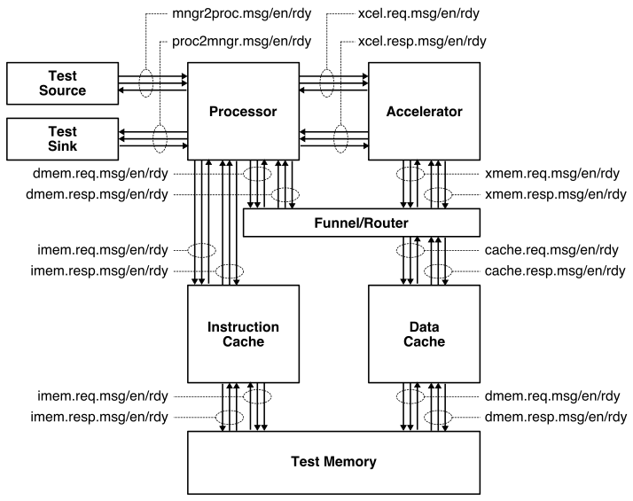
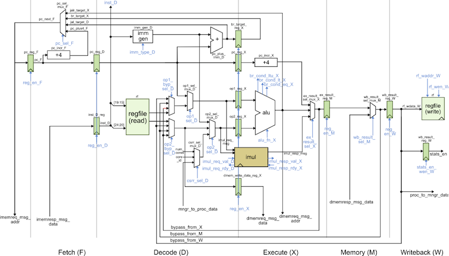
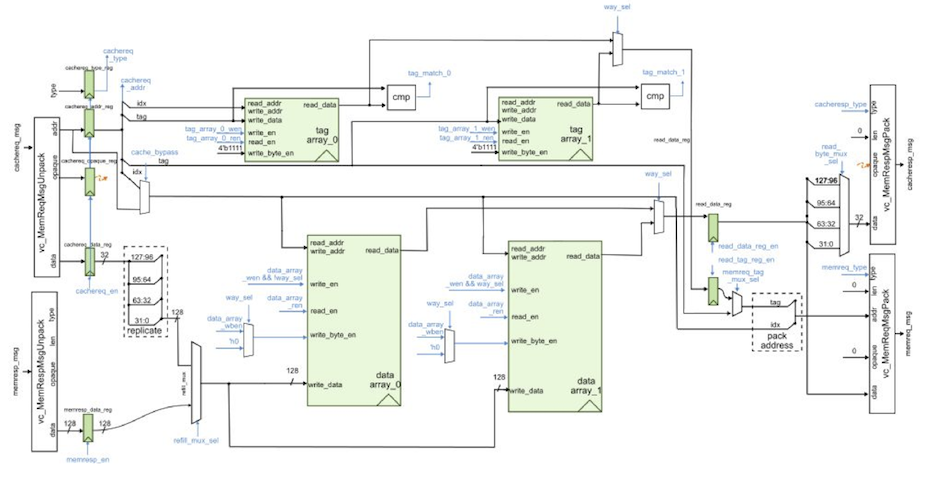
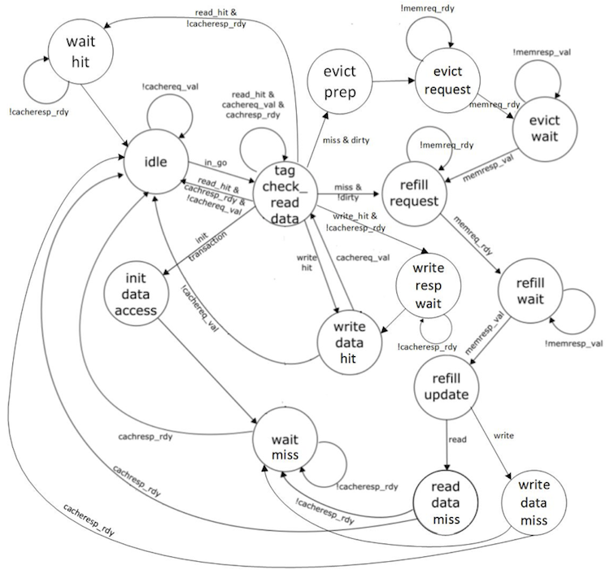
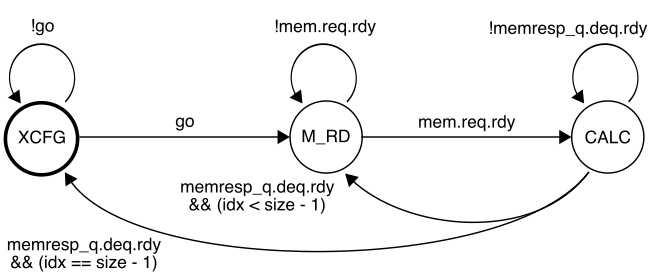

ECE 5745 Section 5: TinyRV2 Accelerators
==========================================================================

 - Author: Christopher Batten
 - Date: March 13, 2020

**Table of Contents**

 - Introduction
 - Baseline TinyRV2 Processor FL and RTL Models
 - Cross-Compiling and Executing TinyRV2 Microbenchmarks
 - Accumulation Accelerator FL, CL, and RTL Models
 - Accelerating a TinyRV2 Microbenchmark

Introduction
--------------------------------------------------------------------------

In this section, we will be discussing how to implement a simple
medium-grain accelerator. Fine-grain accelerators are tightly integrated
within the processor pipeline (e.g., a specialized functional unit for
bit-reversed addressing useful in implementing an FFT), while
coarse-grain accelerators are loosely integrated with a processor through
the memory hierarchy (e.g., a graphics rendering accelerator sharing the
last-level cache with a general-purpose processor). Medium-grain
accelerators are often integrated as co-processors: the processor can
directly send/receive messages to/from the accelerator with special
instructions, but the co-processor is relatively decoupled from the main
processor pipeline and can also independently interact with memory. To
illustrate how to implement a medium-grain accelerator, we will be
working on a simple "accumulation" accelerator that adds all of the values
in an array stored in memory. A much more detailed tutorial that
illustrates a vector-vector-add accelerator including how to push a
complete processor, memory, and accelerator system will be posted on the
public course website shortly.

The first step is to start MobaXterm. From the _Start_ menu, choose
_MobaXterm Educational Edition > MobaXterm Educational Edition_. Then
double click on _ecelinux.ece.cornell.edu_ under _Saved sessions_ in
MobaXterm. Log in using your NetID and password. Click _Yes_ when asked
if you want to save your password. This will make it easier to open
multiple terminals if you need to.

Once you are at the `ecelinux` prompt, source the setup script, clone
this repository from GitHub, and define an environment variable to keep
track of the top directory for the project.

    % source setup-ece5745.sh
    % mkdir $HOME/ece5745
    % cd $HOME/ece5745
    % git clone https://github.com/cornell-ece5745/ece5745-S05-xcel
    % cd ece5745-S05-xcel
    % TOPDIR=$PWD

Baseline TinyRV2 Processor FL and RTL Models
--------------------------------------------------------------------------

The following figure illustrates the overall system we will be using with
our TinyRV2 processors. The processor includes eight latency insensitive
en/rdy interfaces. The mngr2proc/proc2mngr interfaces are used for the
test harness to send data to the processor and for the processor to send
data back to the test harness. The imem master/minion interface is used
for instruction fetch, and the dmem master/minion interface is used for
implementing load/store instructions. The system includes both
instruction and data caches. The xcel master/minion interface is used for
the processor to send messages to the accelerator.

We provide two implementations of the TinyRV2 processor. The FL model in
`sim/proc/ProcFL.py` is essentially an instruction-set-architecture (ISA)
simulator; it simulates only the instruction semantics and makes no
attempt to model any timing behavior. The RTL model in
sim/proc/ProcPRTL.py is similar to the alternative design for lab 2 in
ECE 4750. It is a five-stage pipelined processor that implements the
TinyRV2 instruction set and includes full bypassing/forwarding to resolve
data hazards. There are two important differences from the alternative
design for lab 2 of ECE 4750. First, the new processor design uses a
single-cycle integer multiplier. Second, the new processor design
includes the ability to handle new CSRs for interacting with medium-grain
accelerators. The datapath diagram for the processor is shown below.

We should run all of the unit tests on both the FL and RTL processor
models to verify that we are starting with a working processor.

    % mkdir -p $TOPDIR/sim/build
    % cd $TOPDIR/sim/build
    % pytest ../proc

We also provide an RTL model in `sim/cache/BlockingCachePRTL.py` which is
very similar to the alternative design for lab 3 of ECE 4750. It is a
two-way set-associative cache with 16B cache lines and a
write-back/write-allocate write policy and LRU replacement policy. There
are three important differences from the alternative design for lab 3 of
ECE 4750. First, the new cache design is larger with a total capacity of
8KB. Second, the new cache design carefully merges states to enable a
single-cycle hit latency for both reads and writes. Note that writes have
a two cycle occupancy (i.e., back-to-back writes will only be able to be
serviced at half throughput). Third, the previous cache design used
combinational-read SRAMs, while the new cache design uses
synchronous-read SRAMs. Combinational-read SRAMs mean the read data is
valid on the same cycle we set the read address. Synchronous-read SRAMs
mean the read data is valid on the cycle after we set the read address.
Combinational SRAMs simplify the design, but are not realistic. Almost
all real SRAM memory generators used in ASIC toolflows produce
synchronous-read SRAMs. Using synchronous-read SRAMs requires non-trivial
changes to both the datapath and the control logic. The cache FSM must
make sure all control signals for the SRAM are ready the cycle before we
need the read data. The datapath and FSM diagrams for the new cache are
shown below. Notice in the FSM how we are able to stay in the
TAG_CHECK_READ_DATA state if another request is ready.

We should run all of the unit tests on the cache RTL model to verify that
we are starting with a working cache.

    % mkdir -p $TOPDIR/sim/build
    % cd $TOPDIR/sim/build
    % pytest ../cache

Cross-Compiling and Executing TinyRV2 Microbenchmarks
--------------------------------------------------------------------------

We will write our microbenchmarks in C. Let's start by writing a simple
accumulation microbenchmark. Take a look at the code provided in
`app/ubmark/ubmark-accum.c`:

    __attribute__ ((noinline))
    int accum_scalar( int* src, int size )
    {
      // ''' SECTION TASK ''''''''''''''''''''''''''''''''''''''''''''''''
      // Implement a simple C function to add all of the elements in the
      // source array and then return this result.
      // '''''''''''''''''''''''''''''''''''''''''''''''''''''''''''''''''
    }

    ...

    int main( int argc, char* argv[] )
    {
      test_stats_on();
      int sum = accum_scalar( src, size );
      test_stats_off();

      verify_results( sum, ref );

      return 0;
    }

The `src` array and `ref` value are all defined in the
`app/ubmark/ubmark-accum.dat` file. The microbenchmark turns stats on,
does the actual computation, turns stats off, and finally verifies that
the results are as expected. We need the `test_stats_on()` and
`test_stats_off()` functions to make sure we can keep track of various
statistics (e.g., the number of cycles) only during the important part of
the microbenchmark. We do not want to count time spent in initialization
or verification when comparing the performance of our various
microbenchmarks. These two functions are defined in
`app/common/common-misc.h`.

**To Do On Your Own:** Go ahead and implement the `accum_scalar`
function. We have a build system that can compile these microbenchmarks
natively for x86 and can also cross-compile these microbenchmarks for
TinyRV2 so they can be executed on our simulators. Here is how we compile
and execute the pure-software accumulation microbenchmark natively:

    % cd $TOPDIR/app
    % mkdir build-native
    % cd build-native
    % ../configure
    % make ubmark-accum
    % ./ubmark-accum

The microbenchmark should display passed. Once you are sure your
microbenchmark is working correctly natively, you can cross-compile the
microbenchmark for TinyRV2.

    % cd $TOPDIR/app
    % mkdir build
    % cd build
    % ../configure --host=riscv32-unknown-elf
    % make ubmark-accum

This will create a `ubmark-accum` binary which contains TinyRV2
instructions and data. You can disassemble a TinyRV2 binary (i.e., turn a
compiled binary back into an assembly text representation) with the
`riscv32-objdump` command like this:

    % cd $TOPDIR/app/build
    % riscv32-objdump ubmark-accum | less -p"<accum_scalar"

Take a look at the `accum_scalar` function in the disassembly and see if
you can understand how this assembly implements the C function you wrote.

We have provided you with a simulator that composes a processor, cache,
memory, and accelerator and is capable of executing TinyRV2 binaries. The
simulator enables flexibly choosing the processor implementation (FL vs.
RTL), the cache implementation (no cache vs. RTL), and the type and
implementation of the accelerator. By default, the simulator uses the
processor FL model, no cache model, and a "null" accelerator. So let’s
execute the `ubmark-accum` TinyRV2 binary on the instruction-set
simulator:

    % cd $TOPDIR/sim/build
    % ../pmx/pmx-sim ../../app/build/ubmark-accum

After a few seconds the simulator should display passed which means the
microbenchmark successfully executed on the ISA simulator. The `--trace`
command line option will display each instruction as it is executed on
the ISA simulator.

    % cd $TOPDIR/sim/build
    % ../pmx/pmx-sim --trace ../../app/build/ubmark-accum > ubmark-accum-fl.trace

When dumping out large line traces, it is usually much faster to save
them to a file and then open the file in your favorite text editor. You
can search in the line trace for the CSRW instruction to quickly jump to
where the actual `accum_scalar` function starts executing. Verify that
the simulator is executing the accumulation loop as you expect.

Now that we have verified the microbenchmark works correctly on the ISA
simulator, we can run the microbenchmark on the baseline TinyRV2
pipelined processor RTL model:

    % cd $TOPDIR/sim/build
    % ../pmx/pmx-sim --proc-impl rtl --cache-impl rtl \
        --stats ../../app/build/ubmark-accum
    num_cycles =  758

The number of cycles for your experiment might be difference since you
have written your own accumulation microbenchmark. Now generate a line
trace to dig into the performance:

    % cd $TOPDIR/sim/build
    % ../pmx/pmx-sim --proc-impl rtl --cache-impl rtl \
        --trace ../../app/build/ubmark-accum > ubmark-accum-rtl.trace

The instructor will walk through and explain the line trace.

Accumulation Accelerator FL, CL, and RTL Models
--------------------------------------------------------------------------

We will take an incremental approach when designing, implementing,
testing, and evaluating accelerators. We can use test sources, sinks, and
memories to create a test harness that will enable us to explore the
accelerator cycle-level performance and the ASIC area, energy, and timing
in isolation. Only after we are sure that we have a reasonable
design-point should we consider integrating the accelerator with the
processor.

We have provided you a FL model of the accumulation accelerator. Our
accelerators will include a set of accelerator registers that can be read
and written from the processor using special instructions and the
xcelreq/xcelresp interface. The accumulator accelerator protocol defines
the accelerator registers as follows:

 - xr0 : go/done
 - xr1 : base address of the array src
 - xr2 : size of the array

The actual protocol involves the following steps:

 1. Write the base address of src to xr1
 2. Write the number of elements in the array to xr2
 3. Tell accelerator to go by writing xr0
 4. Wait for accelerator to finish by reading xr0, result will be sum

You can test this model like this:

     % cd $TOPDIR/sim/build
     % pytest ../tut9_xcel/test/AccumXcelFL_test.py -v

We are now going to work on the accumulation accelerator RTL model. Our
accelerator will use the following FSM:

While the accelerator is in the XCFG state, it will update its internal
registers when it receives accelerator requests from the processor. When
the accelerator receives a write to xr0 it moves into the M_RD state. In
the M_RD state, the accelerator will send out one memory read request to
read the current element from the source array. In the CALC state, the
accelerator will wait for the response from memory and then do the actual
accumulation. It then will either move back into the M_RD state if there
is another element to be processed, or move into the XCFG state if we
have processed all elements in the array.

First, choose which language you want to work with by setting the
`rtl_language` parameter in `sim/tut9_xcel/AccumXcelRTL.py`. Then open
the accumulation accelerator RTL which is either in
`sim/tut9_xcel/AccumXcelPRTL.py` or in `sim/tut9_xcel/AccumXcelVRTL.v`.

**To Do On Your Own:** Your task is to finish the state update logic
according to the FSM shown above. You will need to add the transition out
of the XCFG state based on the `go` signal. Once you are finished, you
can test your design like this:

    % cd $TOPDIR/sim/build
    % pytest ../tut9_xcel

Don't forget to verify that everything translates correctly too!

    % cd $TOPDIR/sim/build
    % pytest ../tut9_xcel --test-verilog

We have also included a simulator for just the accumulation accelerator
in isolation which can be used to evaluate its performance.

    % cd $TOPDIR/sim/build
    % ../tut9_xcel/accum-xcel-sim --impl rtl --input multiple --stats
    num_cycles = 807

We could use the simulator to help evaluate the cycle-level performance
of the accelerator on various different datasets as we try out various
optimizations.

Accelerating a TinyRV2 Microbenchmark
--------------------------------------------------------------------------

Now that we have unit tested and evaluated both the baseline TinyRV2
pipelined processor and the accumulation accelerator in isolation, we are
finally ready to compose them. The processor will send messages to the
accelerator by reading and writing 32 special CSRs using the standard
CSRW and CSRR instructions. These 32 special CSRs are as follows:

    0x7e0 : accelerator register  0 (xr0)
    0x7e1 : accelerator register  1 (xr1)
    0x7e2 : accelerator register  2 (xr2)
    ...
    0x7ff : accelerator register 31 (xr31)

Here is a simple assembly sequence which will write the value 1 to an
accelerator register, read that value back from the accelerator register,
and write the value to general-purpose register x2.

    addi x1, x0, 1
    csrw 0x7e0, x1
    csrr x2, 0x7e0

To use an accelerator from a C microbenchmark, we need to embed assembly
instructions directly into a C program. We can do this using the GCC
inline assembly extensions. Take a closer look at the accelerated version
of the accumulation microbenchmark in `app/ubmark/ubmark-accum-xcel.c:`

    __attribute__ ((noinline))
    int accum_xcel( int* src, int size )
    {
      int result = 0;

      asm volatile (
        "csrw ?????, %[src]; \n"
        "csrw ?????, %[size];\n"
        "csrw ?????, x0     ;\n"
        "csrr %[result], ?????;\n"

        // Outputs from the inline assembly block

        : [result] "=r"(result)

        // Inputs to the inline assembly block

        : [src]    "r"(src),
          [size]   "r"(size)

        // Tell the compiler this accelerator read/writes memory

        : "memory"
      );

      return result;
    }

    ...

    int main( int argc, char* argv[] )
    {
      test_stats_on();
      int sum = accum_xcel( src, size );
      test_stats_off();

      verify_results( sum, ref );

      return 0;
    }

The `asm` keyword enables embedding assembly into a C program. We have a
sequence of strings, and each string is one assembly instruction.
`%[src]` is special syntax that tells GCC to put the register that holds
the `src` C variable into that location in the assembly. So if the
compiler ends up allocating the `src` C variable to `x11` then it will
put `x11` into the first assembly instruction.

**To Do On Your Own:** Your job is to replace the `?????` placeholders
with the correct CSR number. You will need to revisit the accumulator
accelerator protocol, and the mapping from accelerator registers to CSR
numbers mentioned above. Once you have filled in the correct CSR numbers,
you can compile and test your program. Note that you cannot natively
compile a microbenchmark that makes use of an accelerator, since x86 does
not have any accelerators!

    % cd $TOPDIR/app/build
    % make ubmark-accum-xcel
    % riscv32-objdump ubmark-accum-xcel | less -p"<accum_xcel"

Everything looks as expected, so we can now test our accelerated
accumulation microbenchmark on the ISA simulator using the FL accelerator
model.

    % cd $TOPDIR/sim/build
    % ../pmx/pmx-sim --xcel-impl accum-fl ../../app/build/ubmark-accum-xcel

Finally, we can run the accelerated accumulation microbenchmark on the
RTL implementation of the processor augmented with the RTL implementation
of the accumulation accelerator:

    % cd $TOPDIR/sim/build
    % ../pmx/pmx-sim --proc-impl rtl --cache-impl rtl --xcel-impl accum-rtl \
        --stats ../../app/build/ubmark-accum-xcel
    num_cycles =  449

Recall that the pure-software accumulation microbenchmark required 758
cycles. So our accelerator results in a cycle-level speedup of 1.7x. We
might ask, where did this speedup come from? Why isn’t the speedup
larger? Let’s look at the line trace.

    % cd $TOPDIR/sim/build
    % ../pmx/pmx-sim --proc-impl rtl --cache-impl rtl --xcel-impl accum-rtl \
        --trace ../../app/build/ubmark-accum-xcel > ubmark-accum-xcel.trace

See if you can figure out exactly what the accelerator is doing. Ideally,
the accelerator would be able to sustain one accumulation per cycle for
full throughput. Why is it not able to do this? What could we do to
further improve the performance of this accelerator?

